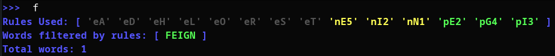
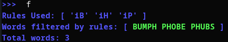
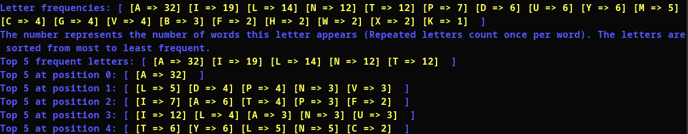

# Wordle List Check
CLI tool to add wordle words and Wordle rules to filter words in the list for the game [Wordle](https://www.nytimes.com/games/wordle/index.html).

## Usage
This uses and requires Zig Version `0.14.0` or `0.14.1`

Use `zig build -Doptimize=ReleaseFast` to build the binary.

## words.txt
A `words.txt` file inside the binary path can be used to add potential words instead of manually adding each word in the tool.

Each word must be split with spaces or lines. For example:
```
WORDS
SPLIT
USING
LINES
```

Words can be case-insensitive, and will always output as uppercase.

A `used.txt` file inside the binary path can be used to filter out words already used by wordle (If they have not used repeat words yet). It uses the same format as `words.txt` above. Use the `u` option to filter out the used words.

## Rules usage
There are 3 types of Wordle rules to filter words. There is an additional rule added where a letter exists as a hint.
* `e(letter)` - This filter excludes any words that contain this letter. This is the Wordle equivalent of a gray letter.
* `i(letter)` - This filter includes words that contain this letter. This is not part of the Wordle rules, but is used to filter from vowel and constant hints, or used to filter possible word choices that contains these words. This rule is shown as blue.
* `n(letter)1-5` - This filter excludes words that have this letter in this position from 1 to 5, **OR** doesn't contain this letter in any other position. This is the Wordle equivalent of a yellow letter.
* `p(letter)1-5` - This filter includes only words that have this letter **AND** must be in this position from 1 to 5. This is the Wordle equivalent of a green letter.

For example, the rule `pA5` is read as a word that has the letter `A`, and must be in position 5. `nB1` is read as a word that has the letter `B`, but must not be in position 1.

## Example usage
Here is an example of using the gray, yellow, and green wordle rules. This outputs the only word 'FEIGN' that meets the rule requirements.


Here is an example of using the include only filter. This can be used to filter words that only contain the letters given, regardless of position.


Here is an example of counting word frequencies per word and per letter position (With only top 5 per letter). This is used to help choose words that can help eliminate words.
